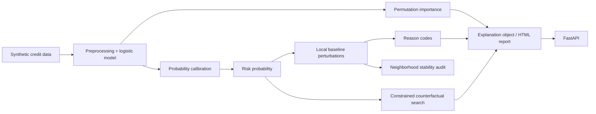

# Credit Default Explainability

A runnable explainable-credit-risk reference project combining **calibrated default probabilities, global permutation importance, local perturbation attribution, reason codes and constrained counterfactual search**.

Everything runs on deterministic synthetic data. The project demonstrates model governance and explainability engineering; it is not a lending policy, legal adverse-action system or financial recommendation.

## Architecture



## Why this project is not just a SHAP screenshot

The repository separates several questions that are often incorrectly collapsed into one plot:

- **Is the probability calibrated?** The classifier is wrapped with sigmoid calibration and reports Brier score as well as ROC-AUC / average precision.
- **Which features matter globally?** Held-out permutation importance measures the drop in ROC-AUC when one raw feature is shuffled.
- **Why did this row receive this score?** A model-agnostic local perturbation replaces each feature with a training baseline and measures the probability change.
- **Are local explanations stable nearby?** Seeded valid numeric perturbations measure top-feature overlap, attribution-direction agreement and probability drift.\n- **What small actionable changes move the model score?** A constrained greedy counterfactual search considers only a small allowlist of synthetic, potentially actionable variables.
- **What should a reviewer see?** The API returns structured reason codes, local sensitivities, probability, threshold and explicit caveats.

The local perturbation values are deliberately labelled as *model sensitivity*, not causal explanations or Shapley values.

## Explanation stability audit

A local attribution can look plausible while changing sharply for nearly identical inputs. The CLI now runs a deterministic neighborhood audit around the reported example:

- small Gaussian perturbations are applied only to numeric features;
- ratios remain within `[0, 1]`, counts/ages stay non-negative and categorical fields remain unchanged;
- top-k feature overlap and attribution-direction agreement are measured for every neighbor;
- probability standard deviation and maximum drift separate explanation instability from score instability;
- seed, sample count, noise level and top-k are stored with the metrics.

```bash
python -m creditxai.cli --rows 6000 --seed 42 --stability-samples 100
jq '.explanation_stability' artifacts/analysis.json
```

This is a local sensitivity diagnostic, not evidence of causal correctness or global robustness. Noise policy and acceptance thresholds must be reviewed for the deployment domain.

## Synthetic features

```text
income
debt_ratio
late_payments
utilization
account_age_months
age
employment
housing
```

The synthetic target is sampled from a known nonlinear-ish risk function. This gives the public project a reproducible signal while avoiding real customer data.

## Quick start

```bash
python -m venv .venv
source .venv/bin/activate  # Windows: .venv\Scripts\activate
pip install -r requirements.txt
python -m creditxai.cli --rows 6000 --seed 42
```

Artifacts:

```text
artifacts/analysis.json
artifacts/report.html
artifacts/credit_risk.joblib
```

## API

```bash
uvicorn app.api:app --reload
curl http://localhost:8000/demo
```

`POST /score` accepts one synthetic applicant and returns:

```text
default probability
review decision boundary
reason codes
per-feature local probability deltas
counterfactual candidate
methodological caveat
```

## Counterfactual constraints

The demo counterfactual search does **not** modify age, employment or housing. It only explores the allowlisted synthetic fields:

- utilization;
- debt ratio;
- late-payment count;
- income.

This is still not a recommendation engine. The purpose is to demonstrate how an explanation system can encode actionability constraints instead of allowing an optimizer to mutate every input indiscriminately.

## Docker

```bash
docker build -t credit-default-explainability .
docker run --rm -p 8000:8000 credit-default-explainability
```

## Tests / CI

```bash
ruff check .
pytest -q
```

CI trains the deterministic synthetic model, exercises explanation stability and counterfactual paths, generates artifacts and builds the container.

## Governance / limitations

A high model score is not a legal lending decision. Permutation importance can be distorted by correlated variables; one-feature perturbations can create unrealistic combinations; and counterfactual feasibility is domain-specific. A real deployment would require fairness testing, policy controls, data lineage, monitoring, protected-class review, legal validation and human oversight.

## Portfolio signal

**Python · scikit-learn · probability calibration · XAI stability · XAI · permutation importance · counterfactual explanations · model governance · FastAPI · Docker · CI/CD**
